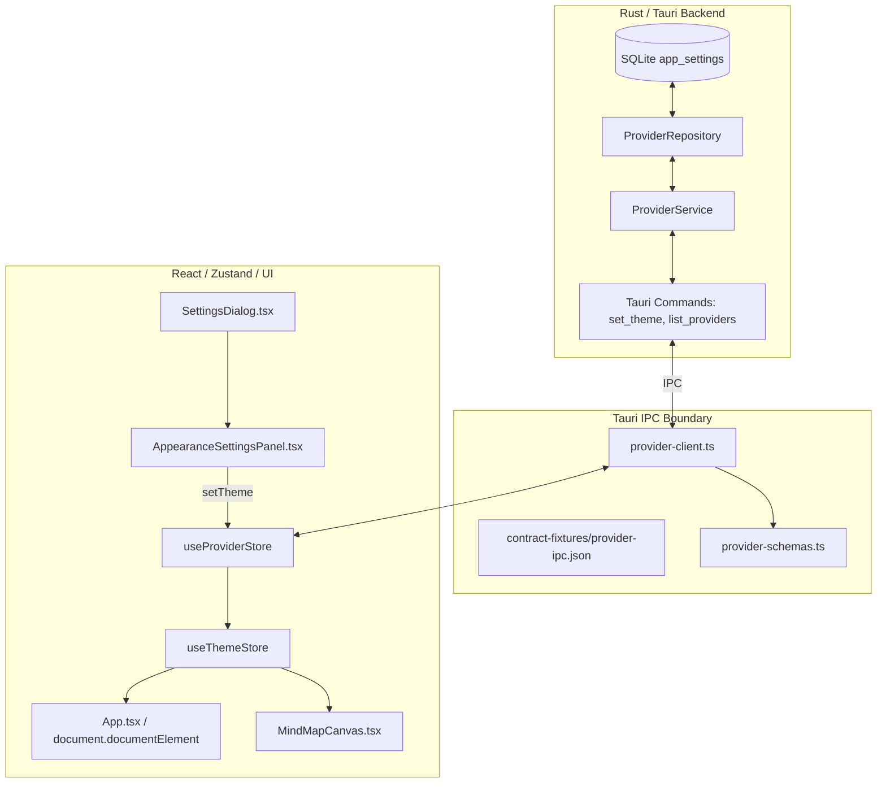

# 深色模式（Dark Mode）与外观设置技术设计

## 1. 架构与边界设计

### 1.1 总体架构分层



### 1.2 状态流转与响应机制

1. **持久化源（Source of Truth）**：
   - SQLite `app_settings` 表存储键 `"theme"`，取值为 `"system"` | `"light"` | `"dark"`。
2. **水合（Hydration）**：
   - 启动时调用 `list_providers`，返回字段 `theme: "system" | "light" | "dark"`（缺省时为 `"system"`）。
   - `useProviderStore` 接收到 `theme` 后同步更新 `useThemeStore`。
3. **运行时解析（Resolved Theme）**：
   - 当 `themePreference === "system"` 时：根据 `window.matchMedia("(prefers-color-scheme: dark)").matches` 计算 `resolvedTheme = isDark ? "dark" : "light"`。
   - 当 `themePreference === "light"` 时：`resolvedTheme = "light"`。
   - 当 `themePreference === "dark"` 时：`resolvedTheme = "dark"`。
4. **DOM 渲染副作用（DOM Side Effect）**：
   - `App.tsx` 订阅 `resolvedTheme`，在 `document.documentElement` 上动态 toggle `.dark` class（`document.documentElement.classList.toggle("dark", resolvedTheme === "dark")`），并设置 `document.documentElement.style.colorScheme = resolvedTheme`。
   - 同时，当偏好为 `"system"` 时，挂载 `matchMedia("change")` 事件监听器，确保 OS 切换深浅色时实时同步。

---

## 2. 后端数据模型与 IPC 契约

### 2.1 Rust 后端领域模型 (`src-tauri/src/providers/domain.rs`)

```rust
#[derive(Debug, Clone, Copy, PartialEq, Eq)]
pub enum ThemePreference {
    System,
    Light,
    Dark,
}

impl ThemePreference {
    pub fn parse(value: &str) -> Option<Self> {
        match value {
            "system" => Some(Self::System),
            "light" => Some(Self::Light),
            "dark" => Some(Self::Dark),
            _ => None,
        }
    }

    pub fn from_setting_text(value: &str) -> Result<Self, ProviderError> {
        Self::parse(value).ok_or(ProviderError::Protocol)
    }

    pub fn as_setting_text(self) -> &'static str {
        match self {
            Self::System => "system",
            Self::Light => "light",
            Self::Dark => "dark",
        }
    }
}
```

### 2.2 数据访问与服务层

- 常量：`pub const THEME_SETTING_KEY: &str = "theme";`
- 读取默认值：不存在时返回 `ThemePreference::System`；如果存入非法值，返回 `ProviderError::Protocol`。
- 服务方法：
  - `ProviderService::get_theme(&self) -> Result<ThemePreference, ProviderError>`
  - `ProviderService::set_theme(&self, theme: ThemePreference) -> Result<ThemePreference, ProviderError>`

### 2.3 Tauri 命令与 DTO

```rust
pub const PROVIDER_COMMAND_NAMES: &[&str] = &[
    // ... 既有命令
    "set_theme",
];

#[derive(Debug, Clone, PartialEq, Eq, Deserialize, Serialize)]
#[serde(rename_all = "snake_case", deny_unknown_fields)]
pub struct SetThemeRequest {
    pub theme: String,
}

#[derive(Debug, Clone, PartialEq, Eq, Deserialize, Serialize)]
#[serde(rename_all = "snake_case", deny_unknown_fields)]
pub struct SetThemeResult {
    pub theme: String,
}

pub struct ListProvidersResult {
    // ...
    pub language: String,
    pub theme: String,
}
```

---

## 3. 前端设计与类型定义

### 3.1 核心类型 (`src/lib/theme/types.ts`)

```ts
export type ThemePreference = "system" | "light" | "dark"
export type ResolvedTheme = "light" | "dark"
```

### 3.2 系统解析与 Store (`src/lib/theme/`)

- `resolve.ts`:
  - `resolveSystemTheme(isDarkMode: boolean): ResolvedTheme`
  - `effectiveTheme(preference: ThemePreference, systemIsDark: boolean): ResolvedTheme`
- `theme-store.ts`:
  - UI 内存状态 `useThemeStore`，包含 `theme: ThemePreference`、`resolvedTheme: ResolvedTheme`、`setThemePreference(pref: ThemePreference)`、`syncSystemTheme(isDark: boolean)`。
- `useTheme.ts`:
  - 导出便捷 hook `useTheme()` 供各组件读取当前偏好及计算出的有效主题。

### 3.3 ProviderStore 扩展 (`src/features/providers/store/index.ts`)

- `ProviderState` 扩充 `theme: ThemePreference`（初始 `"system"`）。
- `loadProviders`: 解包 `result.theme`，设置 `theme` 并水合至 `useThemeStore`。
- `setTheme(client, theme)`: 调用 IPC `client.setTheme(theme)`，成功后更新本地 state 与 `useThemeStore`。

### 3.4 UI 适配与「外观」设置面板

1. **`SettingsDialog.tsx`**：
   - 导航分类类型扩充：`type SettingsCategory = "general" | "appearance" | "providers" | "conversation"`。
   - 导航栏加入 `appearance` 项，使用 `Palette` 图标，文案对应 `settings.dialog.appearanceCategory`。
   - 分类为 `appearance` 时渲染 `<AppearanceSettingsPanel client={client} readOnly={readOnly} />`。
2. **`AppearanceSettingsPanel.tsx`**（新建）：
   - 面板包含面包屑导航：`设置 > 外观`。
   - 面板包含主题字段（`Field` + `Select`）。
   - 三个选项：`跟随系统 (system)`、`浅色 (light)`、`深色 (dark)`。
   - 支持禁用态（`readOnly` 或 `loading`）与错误告警提示。
3. **`MindMapCanvas.tsx`**：
   - `<ReactFlow colorMode={resolvedTheme}>`。
4. **`App.tsx`**：
   - 监听 `resolvedTheme` 与系统媒体查询事件，维护 `document.documentElement` class list。

---

## 4. 验证与测试矩阵

| 层级 | 测试文件 | 覆盖内容 |
|---|---|---|
| 后端仓储与服务 | `src-tauri/tests/provider_profile.rs` | `theme` kv 读写、absent 默认 `system`、非法值协议错误 |
| 后端命令与契约 | `src-tauri/tests/provider_contract.rs` | `set_theme` 注册、参数白名单校验、IPC JSON 契约对齐 |
| 前端 IPC & Schema | `src/lib/tauri/provider-client.test.ts` | zod 校验 `theme` 字段、`setTheme` 请求响应契约 |
| 前端 Theme Store | `src/lib/theme/theme-store.test.ts` | 偏好切换、系统媒体查询同步、有效主题解析 |
| 前端 Provider Store | `src/features/providers/store/store.test.ts` | `loadProviders` 水合 `theme`、`setTheme` 乐观/持久化更新 |
| UI 控件 | `src/features/settings/components/AppearanceSettingsPanel.test.tsx` | 主题下拉项渲染、选择触发 `setTheme`、只读与错误回退 |
| 对话框集成 | `src/features/settings/components/SettingsDialog.test.tsx` | 分类切换至「外观」、渲染外观面板 |
| 整体集成 | `src/App.test.tsx` | 挂载时根据主题设置 `html.dark` class、媒体查询变化响应 |
